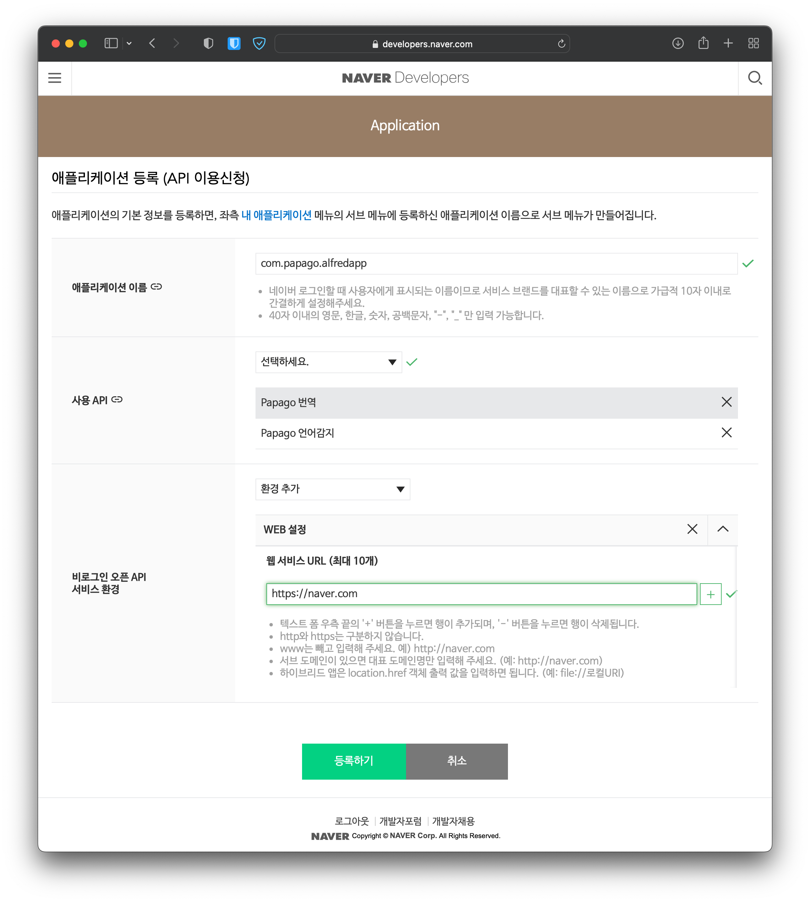
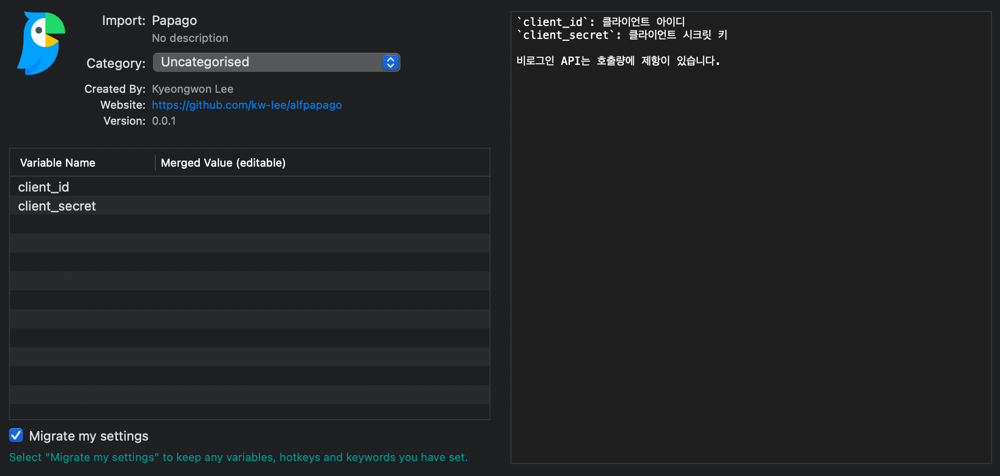
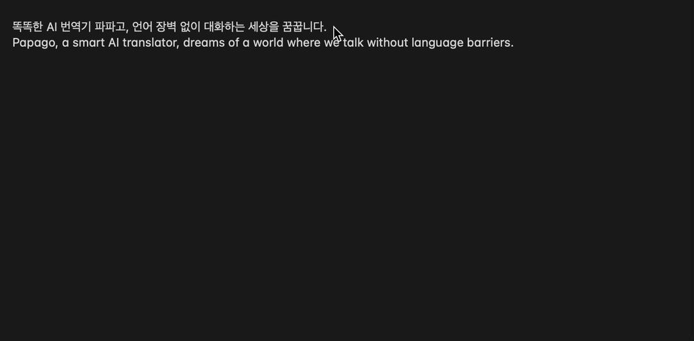

alfpapago : Papago Translation Workflow for Alfred
==============

Papago Translation Workflow for Alfred

Alfred에서 네이버 파파고 번역을 실시하는 워크플로우

* 이 워크플로우는 https://github.com/spearkkk/alfred-workflow/blob/master/papago/Papago.alfredworkflow 가 Python 3 환경에서 작동하도록 수정한 것입니다.
* 워크플로우를 만들어주신 [spearkkk](https://github.com/spearkkk)님께 감사의 말씀을 드립니다.

Install workflow
--------------
 `NaverPapago.alfredworkflow`를 다운로드 받아서 실행한다.

Settings
-------------
* 워크플로우를 사용하기 전 https://developers.naver.com/apps/#/wizard/register 에서 Client ID, Client Secret을 받아야합니다.
  * 자세한 방법은 https://developers.naver.com/docs/papago/papago-nmt-overview.md 를 참고하세요.
  
* 발급받은 API를 워크플로우를 설치할 때 입력해주세요.
  

Usage
--------------
* `papago {query}` {query} 자리에 원하는 문장을 입력하면 파파고 번역 결과와 원본 텍스트를 복사하실 수 있습니다.



Build
--------------
```bash
bash ./make.sh
```

Requirements
--------------

* python3
  * [alfred-workflow-py3](https://github.com/kw-lee/alfred-workflow-py3.git)
  * requirements.txt

```bash
git submodule update --init --recursive
pip install -r requirements.txt -t workflow/lib
```

License
--------------
- requests library (Apache License 2.0)

Changelog
--------------

- `v0.0.1`: the first release